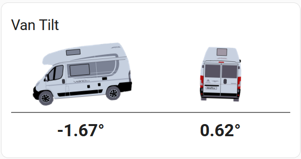
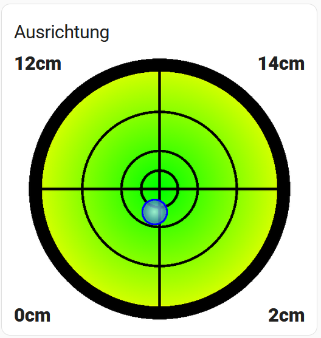

# van-tilt-sensor-custom-card
Custom home assistant lovelace card showing how tilted the van is

To install the card, create a new folder in your "homeassistant/www/" directory called "van-tilt-card" and download the files to this directory. Then in Home Assistant go to Configuration - Lovelace Dashboards - Resources and click "Add Resource". Enter "/local/van-tilt-card/van-tilt-card.js" for the URL and "JavaScript Module" for the type and click create. Back in your main dashboard, you can now manually add the new card with the following code:

    type: 'custom:van-tilt-card' 
    entity_x: sensor.filtered_x_angle 
    entity_y: sensor.filtered_y_angle 

    type: custom:van-tilt-card-vario545
    entity_x: sensor.panroll
    entity_y: sensor.panpitch
  

    type: custom:van-tilt-card-bubble
    title: Ausrichtung
    size: 350
    entity_x: sensor.panroll
    entity_y: sensor.panpitch

